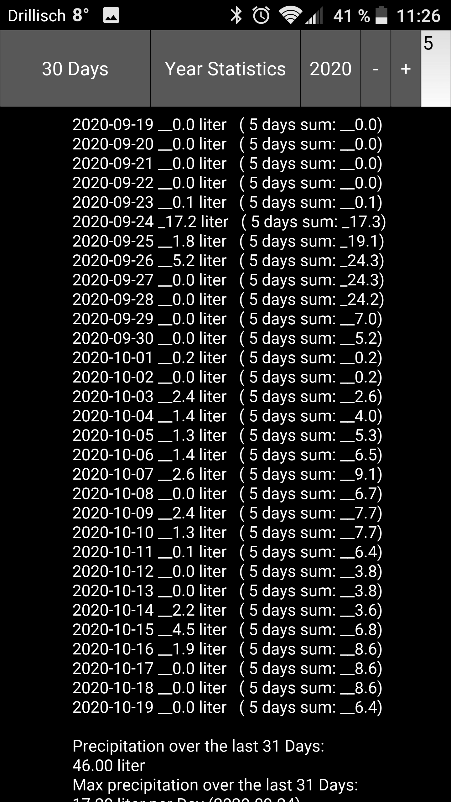
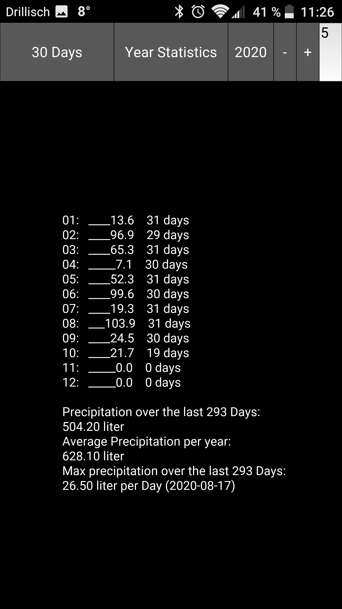

<!-- https://code.visualstudio.com/docs/languages/markdown 
preview in Visual Studio Code: Ctrl + Shift + V
-->

# WeatherQuery

This project implements a rapid prototype for a precipitation calculation app for Android written in Python using the Kivy - Open source Python library (https://kivy.org/#home). The main goal was to try out the Kivy framework using a *real* smartphone application for my personal use. The actual place is my home town hardcoded in the sourcecode but can be adjusted easily. The weather data is queried from www.wetter.com. The time frame for avaraging the precipitation summation can be configured in the app (default is 5 days).

